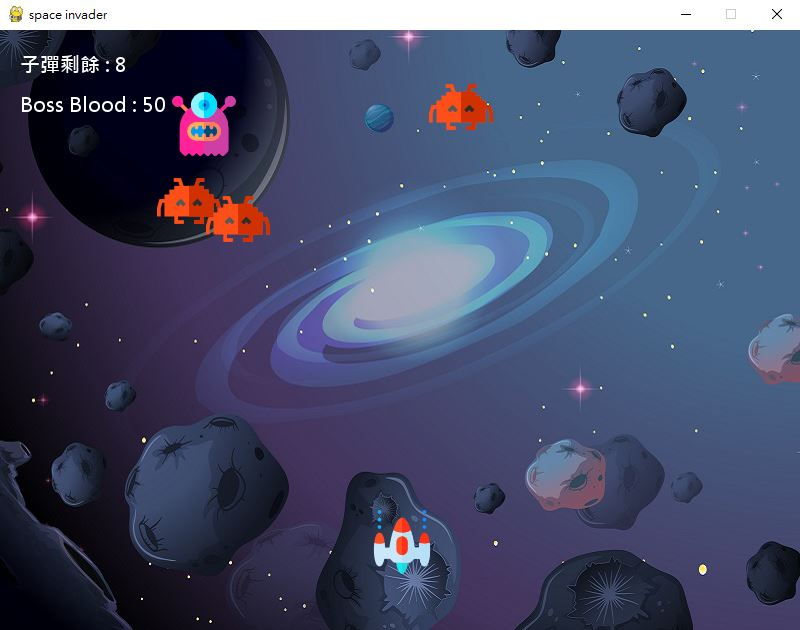
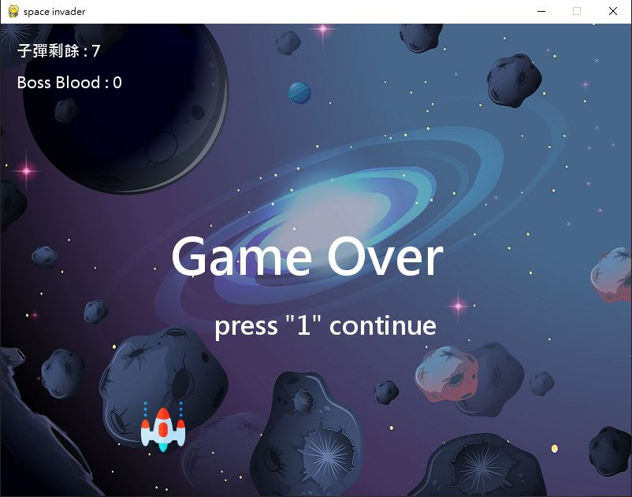

# 星際侵略者pygame小遊戲

## 專案說明

### 專案動機

從小就喜歡玩電腦遊戲，長大學了程式，發現透過基本的遊戲框架搭配程式語言，可以很快的就實現出很多兒時就在玩的遊戲，覺得非常有趣！

### 專案架設

使用python的pygame框架來時做遊戲，基本的語法是參考pygame的相關document

### 環境安裝

- 安裝依賴庫
    
    ```bash
    pip install pygame
    ```
    
- 運行main.py
    
    ```bash
    python main.py
    ```
    

### 操作方式

- 遊戲規則
    - 擊敗Boss則遊戲獲勝
    - 在擊敗小怪前無法對Boss造成傷害
- 基本操作
    - 上下左右鍵移動戰機
    - 空白鍵發射子彈
    - R 補充子彈
- 遊戲畫面
    - 遊戲開始
        
        
        
    - 遊戲結束
        
        